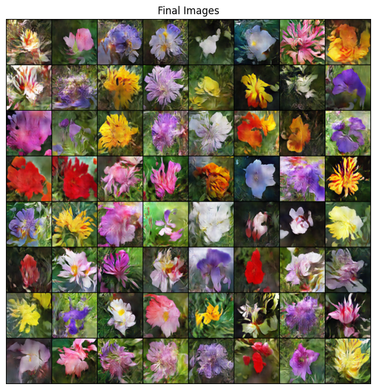

# Painting with neural networks

This repository contains code associated with Bachelor's Thesis, developed by [Jozef Barut](https://github.com/BarutJozef),
with the supervision of [NGUYEN THU, Giang, doc., Ing., PhD.](https://github.com/giangzuzana) .

Project aims to train a generative deep learning model for image synthesis. Encapsulating the result into
web page that can be interaced with easily dockerizing this application.

## Machine learning 
Machine learning part of this project has two models implemented.

One is a simple __GAN__ implementation that you can use to get familiar with 
__generative adversarial networks__, how they are modeled to achieve image generation, 
their training process, etc. This is contained in the [digits_gan](deep_learning/digits_gan) folder.

Second is more complex optimized one inspired by [TAC-GAN](https://github.com/dashayushman/TAC-GAN)
where the text encoding part of [CLIP](https://github.com/openai/CLIP) model is used as a 
pretrained text encoder. Folder coresponding with this is 
[main_model](deep_learning/main_model).

### Technical details

The excellent [PyTorch](https://pytorch.org/) deep learning library and it's submodules are
used to implement both models. This library of course has the option to speed up the deep learning
process on __GPU's__ with __Nvidia's CUDA__ library. You check if your GPU is CUDA capable
[here](https://developer.nvidia.com/cuda-gpus).

To not clutter package installation, two distinct __requirements.txt__ files are present, 
if you don't  have a capable GPU, you can install dependencies with 
```pip install -r requirements_cpu.txt```, otherwise use ```pip install -r requirements_gpu.txt```.

Both sub-folders of deep learning contain __training_loop.py__ python script which can be run for
training of given model. These scripts follow rules listed below.
- scripts assume the working directory is __sub-folder__ that it is in.
- every file, such as plots, model checkpoints and reports is saved into the ```saved/``` folder
 which is also automatically created.
- to customized number of __training epochs__ and __checkpoints__, you can adjust the variables in the
begging of the scripts right after imports.
  - _checkpoints saves generator and discriminator with epoch number in the file name, 
  as well as generates a row in the progress report plot._
- to use GPU make sure you put 1 in the __determine_device__ function call like so: ```device = determine_device(1)```

### Main Model

Overview of the models architecture can be seen on the image below:

*\*insert architecture picture**

Training was done with __80%-20%  train-test__ split, to test the generalization of model on unseen prompts and for
__zero_shot__ generation.

Parameters for training were:
- __200 epochs__, 
- __latent vector__ size:  __100__ 
- __CLIP__ encoded text vector size: __512__
- __1044__ features maps going into the generator __1024__ for latent vector, with concatenated __20__ for encoded text

Complete inner workings can be seen in [models.py](deep_learning/main_model/models.py).

Results:



### Evaluation

Evaluation of model from the technical standpoint was conducted with two metrics, both computed over the entire
dataset, separately for training and test images.

| Metric            |  Train   |   Test |
|-------------------|:--------:|-------:|
| __Inception Score__ |   2.75   |   2.74 |
| __FID__              |  124.49  | 146.93 |


## Backend
For the backend of the web page application that visualizes generated images, 
a simple [Flask](https://flask.palletsprojects.com/en/3.0.x/) application is used.

Only default route __"/"__ with __GET__ method is available. This route parses one argument
called __"input"__, which represents the text prompt to the model. 
Response is an array of 5 images encoded in __base64__ format.

For running the server, using __docker compose__ or building a __docker container__ is 
highly recommended. More about that in the [Docker](#docker) part. 

Manual set-up requires these steps:
1. Have python 3.10 installed
2. Install requirements listed in [requirements_cpu.txt](requirements_cpu.txt)
3. Make sure you are running the command from the root of the repository, 
as this should be the programs working directory
4. Run
     ```python3 -m flask --app backend/app run -p 3000```
   
   option __-p__ changes the port, as default port _5000_ is often used, which would result in an error
5. Default __GET__ request will respond with __Bad Request__, because of the lack of __"input"__ argument
 
   Try this link: [http://127.0.0.1:3000/?input=red](http://127.0.0.1:8001/?input=red) if that happens
 
## Frontend

Frontend of the application was created with reactive framework called 
[Vue.js](https://vuejs.org/) to enable requesting and re-rendering of generated images
without refreshing the whole page.

It is a simple Single page app, that has a text prompt and a "generate" button. Images
are displayed after the first request to [backend](#backend).

Running the frontend is the easiest using __docker compose__ or building a 
__docker container__.  More about that in the [Docker](#docker) part. 


Manual set-up requires these steps:
1. Have [Node.js](https://nodejs.org/en) installed
2. in the [frontend/](./frontend) folder execute ```npm install```
3. Run ```npm run dev``` after the installation is complete
4. The app should be running right here: http://localhost:5173/

## Docker

To streamline the deployment of the different parts of this project and to avoid 
__architecture__ or __OS__ incompatibilities, we use [Docker](https://www.docker.com/) 
and it's tools. Please make sure you [Docker Engine](https://docs.docker.com/engine/install/)
installed.

The project is set up in two ways, that are somewhat building on each other.

### Docker containers

There are two __Dockerfiles__ present [./Dockerfile_backend](Dockerfile_backend),
[./Dockerfile_frontend](Dockerfile_frontend) For both front and backend respectively.
These provide a set of instructions for building their __Docker Images__.

To build the desired __Docker Image__ you can run at the root repository:
    ```docker build . -t image_name  -f ./Dockerfile_name```.
Option __-f__ is used because the __Dockerfiles__ are named differently then just _"Dockerfile"_
which the command would automatically scan for.

Replacing the placeholers as an example ```docker build . -t frontend-docker  -f ./Dockerfile_frontend```

After the image is build, it can be run via:

* ```Docker run -p 8080:8080 frontend_image_name``` for frontend.
* ```Docker run -p 8001:5000 backend_image_name``` for backend.

The mapping of ports should be kept as is, because that is where the apps are exposed to your machine.

### Docker Compose

With [Docker Compose](https://docs.docker.com/compose/) we can combine the building and running of 
multiple __images__ with a single command and [compose.yaml](compose.yaml) file,
further automating the deployment process. 

You will need to have [Docker Compose](https://docs.docker.com/compose/install/) 
plugin installed in addition to the __Docker Engine__.

When you have __Compose__ installed, simply run ```docker compose up ``` at the same directory 
as the _yaml_ file. After everything is finished, both dockerized services should be up and running. 
You can check in the ["Painting with Neural Nets"](http://127.0.0.1:8080 ) frontend app, 
if it is showing and requests are correctly resolving.


